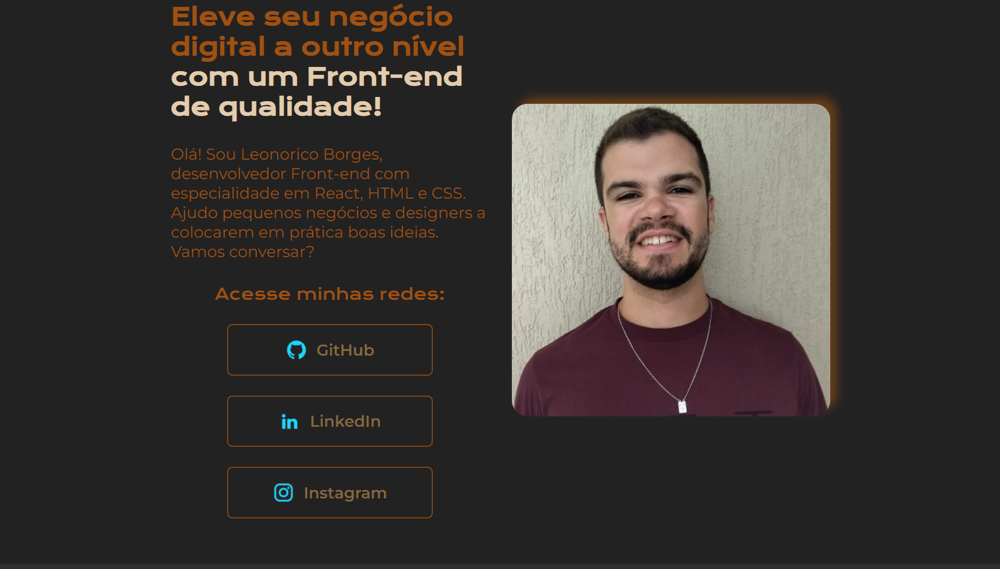

# **Portfolio de Leonorico Borges**
## *Projeto de portfolio desenvolvido com os cursos de HTML e CSS da Alura*

Este projeto é um portfolio de Leonorico Borges, inicialmente desenvolvido com o apoio dos cursos de HTML e CSS da Alura, e, em sequência, melhorado pelo autor. Você pode visitá-lo e analisá-lo por meio [deste link](https://portfolio-leonorico-borges.vercel.app/).

O portfolio conta com três páginas:

As duas primeiras páginas e suas folhas de estilo foram desenvolvidas com apoio dos cursos de HTML e CSS da Alura. Posteriormente, melhorias foram feitas para que os códigos ficasse responsivos, otimizados e organizados, além de estarem com um estilo escolhido pelo próprio autor.

A terceira página foi totalmente criada e desenvolvida pelo autor, bem como sua folha de estilo.

Todo o código foi feito apenas com as linguagens HTML e CSS e encontra-se disponível nesse mesmo repositório para melhor análise.
